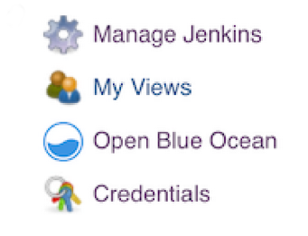
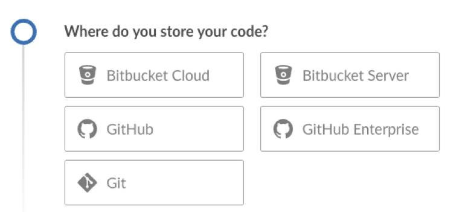
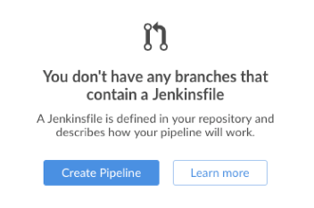
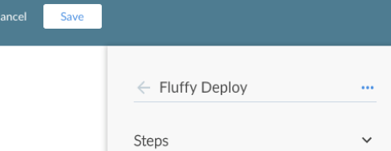
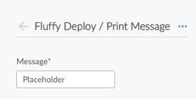
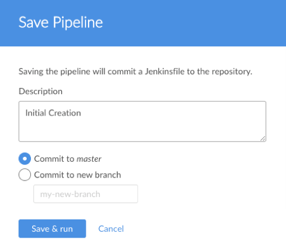
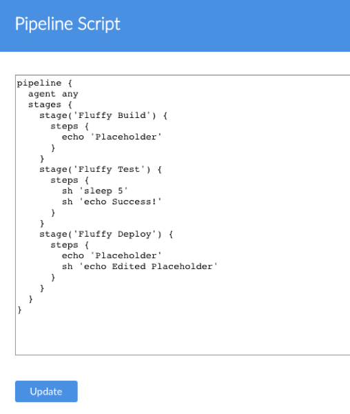
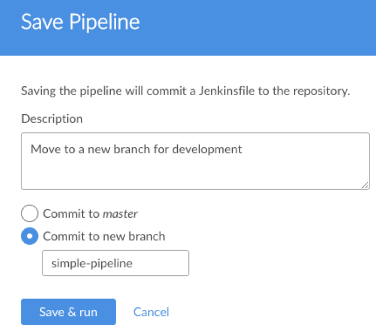
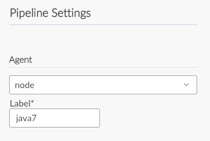
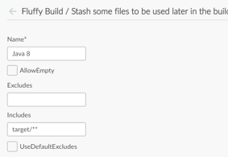

# Pipeline Workshop

### VirtualBox Setup
Setup:  You must have Virtualbox 5.2.6 & Vagrant 2.0.2 installed.

Download the following file (1GB!) to your environment: https://drive.google.com/open?id=1KYpeDQHvPc4Mk4q4fkSCZ-Y04hXSOS5s

Unzip the file cloudbees-training-pipeline-intro.zip and CD into the cloudbees-training-pipeline-intro folder.  Run 'vagrant up' to start the environment.

### Docker Setup

The training environment consists of three servers:
1. [Jenkins Master](http://localhost:5000) username/password (butler/butler)
1. [Gitserver](http://localhost:5022) username/password (butler/butler)

The Gitserver has two repos:
1. `butler/pipeline-intro-demo`
1. `butler/pipeline-intro-lab`

We'll only use pipeline-intro-lab in this course.

1. In your browser navigate to http://localhost:5000
1. Goto the Jenkins master and add a license.
1. Log into Jenkins and click Open Blue Ocean

> Goals:
> *	Create and run a Pipeline in the Blue Ocean Editor
> *	Edit a Pipeline in the Blue Ocean Editor
>
>  Before we begin the lab we need to create a new Pipeline, configure Jenkins to work with the repo in Gitserver, and create secure access to the repo by adding an SSH key to Gitserver.  Once we can connect to Gitserver (to save our Jenkinsfile) we'll create a basic Pipeline with three stages and dummy steps.

#### Setup Git Access

In Blue Ocean click on "New Pipeline".  You'll be asked where your code will be stored; pick "Git"

*	Enter the SSH (not URL) for the pipeline-intro-lab repo: `ssh://git@gitserver:5022/butler/pipeline-intro-lab.git`
*	You'll need to set up an SSH key in Gitserver this one time.  Copy the key text from the box then go into Gitserver:
*	Select 'Your Settings' from the top pane drop down
*	Select 'SSH/GPG Keys'
*	Click the 'Add Key' button, give the key a name and paste in the copied text and click 'Add Key'

#### Create a Pipeline

*	Back in Blue Ocean click "Create Pipeline"
*	The pipeline job will be created but you will get this popup:

*	Click "Create Pipeline"

You are now in the Blue Ocean Visual Pipeline Editor.  A base flow is displayed.  Click on the plus '+' in the editor to add three stages: `Fluffy Build`, `Fluffy Test`, and `Fluffy Deploy`.

Add a step to each stage using the "+ Add Step" button on the right pane.  Select "Print Message" from the dropdown list and put placeholder in the Message box.

Save the pipeline in master branch.

The pipeline will run and you can now see the Jenkinsfile in the repo.  Now we'll make it actually do something.  Click pencil icon to the left of the branch to return to the visual editor

#### Edit a Pipeline

Make the following changes to your stages:
* **Fluffy Test** - Delete the placeholder step and add two steps
  * Shell script: sleep 5
  * Shell script: echo Success!
* **Fluffy Deploy** - add an additional step:
  * Shell script: echo Another Placeholder

Save the pipeline.  View the output in Blue Ocean to see the steps executed.  Now use the Blue Ocean "Pipeline Code Editor" to update the Fluffy Deploy step from Another Placeholder to Edited Placeholder.  Access the Code Editor by hitting ctrl-s(cmd-s), type your changes and hit Update.

Go back to the Fluffy Deploy stage in the GUI and see the edited step.  This change is not saved!  Click Save to commit the changes to the master repo.  

> See [Solution 1](./docs/section1solution.md) for the complete solution.

### Section 2  Create a Pipeline with Parallel Stages

> Goals:
> *	Create and run a Pipeline in a feature branch
> *	Add artifact archiving and test result publishing
> *	Add parallel stages
> *	Migrate the Pipeline to the master branch
>
>   We need to move the Jenkinsfile to another branch so we can develop without impacting the existing version in master.  All new development should be done in a feature branch as a best practice.  Then we'll add real content to the Pipeline: scripts to run a build, test our build and then deploy it.

We can move the Pipeline Jenkinsfile and create a new branch from within the Blue Ocean editor.  Click "Save", add a description then select "Commit to new branch" and call the new branch 'simple-pipeline'.

If you refresh your Gitserver session you will that 'simple-pipeline'has been created and populated from master.  

Open your pipeline in the Blue Ocean Visual Editor and delete all steps for all the stages.  It will show errors; ignore them.

Make the following additions to your stages:
* **Fluffy Build** - Shell script: `./jenkins/build.sh`
* **Fluffy Test** - Shell script: `./jenkins/test-all.sh`
* **Fluffy Deploy** - Shell script: `./jenkins/deploy.sh staging`

Save and run the Pipeline, check the output in Blue Ocean.  You can see each stage run and view the output from each stage individually.

Now we'll add steps to archive artifacts and publish test results.

Add the following steps to your stages:
*	**Fluffy Build** - Archive the artifacts: `target/*.jar`
*	**Fluffy Test** - Publish JUint test result report: `target/**/TEST*.xml`

Save the Pipeline in 'simple-pipeline' and run; check the output in Blue Ocean.

>  Now we'll add parallel stages to allow steps to run concurrently.  Adding parallel stages greatly reduces run time and should be used whenever stages in a Pipeline can run concurrently.  You should size your agents accordingly so that parallel jobs are not waiting on an executor.  Once we finished and test, we'll migrate our changes to master.

Add four parallel stages to Fluffy Test by clicking on plus (+) sign beneath the existing stage.  Name the stages and create the steps in each as listed below:

* **Backend**
  *	Shell script: `./jenkins/test-backend.sh`
  *	Publish Junit test result report: `target/surefire-reports/**/TEST*.xml`
*	**Frontend**
    *	Shell script: `./jenkins/test-frontend.sh`
    *	Publish Junit test result report: `target/test-results/**/TEST*.xml`
*	**Performance** - Shell script: `./jenkins/test-performance.sh`
*	**Static** - Shell script: `./jenkins/test-static.sh`

Save the Pipeline in 'simple-pipeline' and run; check the output in Blue Ocean. Notice the total execution time compared to the much simpler versions executed earlier.

Now migrate the Pipeline to the master branch by saving it and choosing "Commit to new branch" and putting in master.   

> See [solution 2](./docs/section2solution.md) for the complete solution.

### Section 3 Multi-environment Pipeline

> Goals:
> *	Create and run a Pipeline in another feature branch
> *	Control the agent where the Pipeline or steps execute
> *	Stash and unstash files from one stage to the next

>   Now we're starting to add more advanced functionality.  We can specify a specific agents or agents by label for execution of the entire Pipeline and for individual steps.  This can be useful for running builds in QA vs. Production or leveraging parameters (discussed later) to control where steps execute.  We'll also add the Git stashing functionality to save the job state.  Then we'll double the number of stages and run our build in Java 7 and Java 8 environments simultaneously.

We need to create a new branch to work in.  Open the Jenkinsfile in the Blue Ocean Visual Editor and save it to a new branch called multi-env-pipeline.

1. Edit the Pipeline's agent to use Node `java7` (this is included in the lab environment.)
1. Save and run the Pipeline.  In the logs you'll see it now always runs on the node named `jdk7-node`.

We can also control where individual stages execute.  Under each of the stages set the node to `java8`.  Under the Fluffy Build stage add a step to stash files:

Name= `Java 8`, Includes = `target/**` as shown:

Using the Code Pipeline Editor add a step at the start of each of the Test and Deploy stages to unstash the files.

Now set the parallel steps to execute on different agents to improve performance.  We'll double the workload but should only see a marginal increase in execution time.  In the Pipeline Code Editor (⌘-s) rename the existing Fluffy Test stages to xxJava8 (e.g. BackendJava8).  Add four more parallel stages named xxJava7 (e.g. BackendJava7).

For each of the new Test stages
1. set to run on the corresponding node ('java7')
1. unstash the files where needed for each node
 (Note: a simple way to do this is make the change once in the Visual Editor then use the code editor to copy those changes.)

Now update Fluffy Deploy to use node java7 and unstash the appropriate files.  Save your changes and run the Pipeline.  Note the duration: it has likely gone down even though we've added more tasks and doubled the stages.  

> See [Solution 3](./docs/section3solution.md) for the complete solution.

### Section 4

> Goals:
> *	Wait for user input before deploying
> *	Add a checkpoint from which the Pipeline can be restarted
> * Migrate the Pipeline to the master branch
>
>   It's often useful to include a gate in a Pipeline to get user input.  This could be to approve a build for final deployment, specify an environment where the build should happen or other times human interaction is needed.  In this exercise we'll wait for user approval before proceeding with the deployment.

In the Blue Ocean Visual Editor open the multi-env-pipeline job add a new stage called Confirm Deploy.  Add a step "Wait for interactive input" with the message Is the build okay to deploy? and set Ok as Yes

Now bring the job up in the Blue Ocean Pipeline Code editor and move the Fluffy Deploy stage after Confirm Deploy.  This will prevent the Fluffy Deploy stage from running unless a positive response is received from Confirm Deploy.  Save and run the job, notice the input request:

Click Yes and the Pipeline will complete successfully; click Abort and the pipeline will fail and end.  (This is an excellent place for a post step.)

Now we'll add a checkpoint to the Confirm Deploy stage before the user input step.  This will allow the Pipeline to be saved and restarted.  From the Blue Ocean Visual editor select "Capture checkpoint of execution state from which pipeline can be restarted later" and give it the name 'Ready to Deploy'.  The syntax is:  checkpoint 'Ready to Deploy' Run the Pipeline and chose 'abort' at the input.  Now exit Blue Ocean and find Checkpoints on the left pane.  You'll see the checkpoint you just created.

Restart the Pipeline from this checkpoint and go back into Blue Ocean and the job output.  You'll be back at the user input.  Select Yes and the Pipeline will complete successfully.
*Note: Checkpoints can be inefficient as they hold agent resources.  Use only when necessary and always with a timeout parameter in the step so the resources aren't held indefinitely.*

 Save the Pipeline to the master branch.  This is now a complete, working CI/CD pipeline!  

 > See [Solution 4](./docs/section4solution.md) for the complete solution.

### Section 5 The Sexy Extras!

> Purpose:
> *	Move some of the steps to post sections
> *	Add a when directive to skip deployment when not running on the master branch
> *	Add and use a parameter

There are more advanced function available in Pipelines that let you build intuitive and flexible jobs, taking steps only when necessary and keeping you informed of job progress.  Leverage these options to really make your Pipelines automated and streamline your CI/CD process.

>Post Sections: Post sections define additional steps to run when a Pipeline or stage completes.  Post sections are conditionalized, allowing for steps to be run only in defined circumstances.  The available post-conditions are always, changed, failure, success, unstable and aborted.

We'll add a post section to move the archiving, stashing and JUnit tests to make them conditional depending on the result of the stage.  First save the Pipeline to a new branch called finished-pipeline.  Using Code Pipeline editor (the Visual Editor does not support post steps yet) edit the stages as below:

*	Fluffy Build stage:
  *	Move Archive the artifacts with a post success condition
  *	Move Stash with a post success condition
*	Fluffy Test stage:
  *	Move Junit test results to a post always condition in after each state (four total)

Save your changes to the finished-pipeline branch and run.

Now we'll add some intelligence to the Pipeline.  We only want the application to build only when the Pipeline is run from the master branch so we'll add a when directive to both deploy stages.  The when directive has a number of available conditions, the syntax reference.

      when {
        branch: 'master'
      }

Notice that the Pipeline completed without stopping for user input.  Since we're on the finished-pipeline branch both deploy stages were skipped.  The when directive acts as a Boolean operator, skipping that when the value returns false.

Finally we'll add a parameter to the Pipeline and use it in place of a hardcoded value.  Parameters can be passed to the Pipeline at run time, from a marker file, or from a shared library.  Parameter values can also be used as conditions in a when directive.

In the Blue Ocean Code editor add a string parameter called DEPLOY_TO with a value of dev and a description of Deploy where.  By convention parameters are added at the end of the script.

    parameters {
        string(name: 'DEPLOY_TO', defaultValue: 'dev', description: 'Deploy where')
    }

Now update the shell script `./jenkins/deploy.sh` step to use the parameter instead of the hardcoded value staging:

`sh "./jenkins/deploy.sh ${params.DEPLOY_TO}"`

Note that the string is now in double quotes because of the parameter inclusion.

Save and run the Pipeline.  After a successful test migrate the branch to master and run.  This time the when directive will be true and the Pipeline will pause for input.  

> See [Solution 5](./docs/section5solution.md) for the complete solution.

## Documentation

The [Declarative Pipeline Syntax](https://jenkins.io/doc/book/pipeline/syntax/#declarative-pipeline): Up to date reference for building Declarative Pipelines

Jenkins includes a "Snippet Generator" utility to assist in formatting Declarative Pipeline syntax.  The Snippet Generator is on the left pane under "Pipeline Syntax" in the classic UI.  The URL for the lab system is http://localhost:5000/jenkins/job/pipeline-intro-lab/pipeline-syntax/  Documentation is available [here](https://jenkins.io/blog/2016/05/31/pipeline-snippetizer/).

The [Blue Ocean Roadmap](https://jenkins.io/projects/blueocean/roadmap/)
